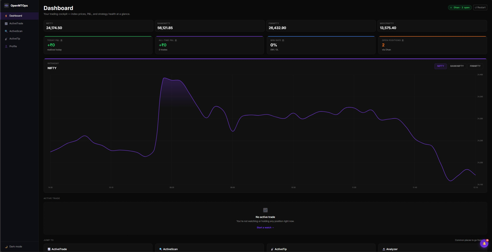
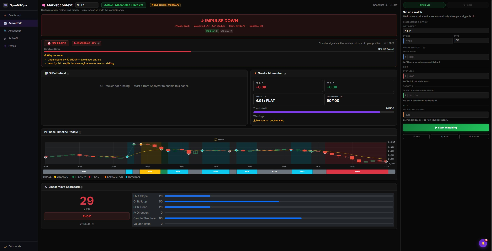
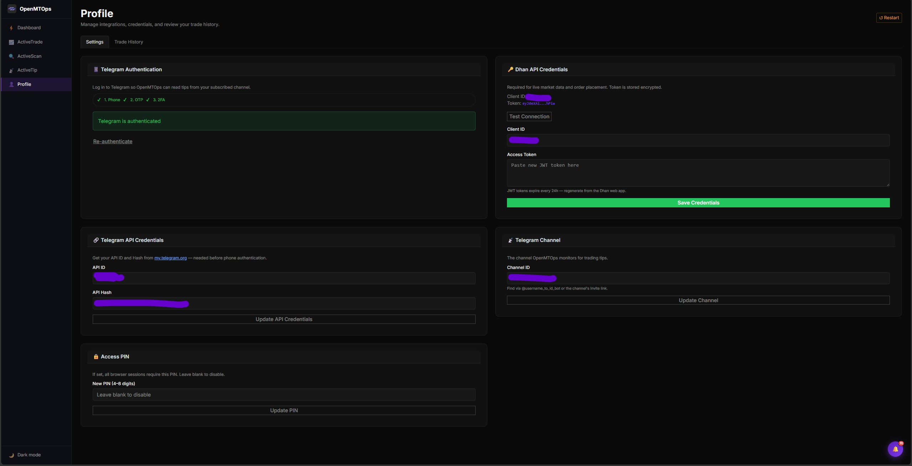
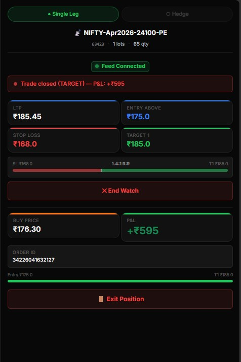

# OpenMTOps — F&O Options Trading Assistant

> Self-hosted Flask + SocketIO web app for Indian F&O trading. Reads signals from Telegram, executes trades into Dhan brokerage, monitors positions live, and surfaces a full strategy dashboard with OI analysis — all from a single browser tab.

---

## Screenshots

### Dashboard
Live index prices, P&L summary, win rate, open positions, and the intraday index chart — all at a glance.



### ActiveTrade
80/20 split — full strategy context on the left, compact live-trade panel on the right. Watch → auto-buy → partial exit at T1 → trailing SL → full exit at T2, all hands-free.



### ActiveScan — Strategy Signals
Pluggable strategy widgets with real-time BUY / NO_TRADE / WAIT signals. One click pre-fills the trade form.


### OI Scanning
Per-strike Open Interest tracking with buildup classification, wall detection, and live delta updates.


### Profile & Settings
Trade history, Dhan + Telegram credential management, and re-authentication — all in one tabbed screen.



### Closed Trades
Completed-trade ledger with entry/exit, lots, quantity, and color-coded P&L.



---

## Requirements

- Python 3.10+
- A [Dhan](https://dhan.co) brokerage account with API access
- A Telegram account + API credentials from [my.telegram.org/apps](https://my.telegram.org/apps)
- A private Telegram channel that posts F&O signals

---

## Installation

### 1. Clone the repository

```bash
git clone https://github.com/CApsUNlocked123/openmtops.git
cd openmtops
```

### 2. Create and activate a virtual environment

```bash
python -m venv venv

# Linux / macOS
source venv/bin/activate

# Windows (Command Prompt)
venv\Scripts\activate

# Windows (PowerShell)
venv\Scripts\Activate.ps1
```

### 3. Install the DhanHQ SDK from GitHub

> **Important:** The standard PyPI release of `dhanhq` does not include the latest WebSocket (MarketFeed) API. You must install directly from the official GitHub source.

```bash
pip install git+https://github.com/dhan-oss/DhanHQ-py.git
```

### 4. Install remaining dependencies

```bash
pip install -r requirements.txt
```

### 5. Start the app

```bash
python app.py
```

Open `http://127.0.0.1:5000` — if no credentials are configured the **setup wizard** launches automatically.

---

## Setup Wizard

On first run the wizard walks you through all required configuration:

| Step | What it configures |
|------|--------------------|
| **1** | Telegram API ID + Hash (from my.telegram.org/apps) |
| **2** | Telegram phone authentication (OTP + optional 2FA) |
| **3** | Dhan Client ID + Access Token |
| **4** | Optional: APP PIN (locks the UI) + Telegram channel ID |

At completion everything is written to `.env` and `config.json` so credentials survive restarts. The wizard is skipped on all subsequent starts as long as `.env` is present.

---

## Power User Setup (skip the wizard)

If you already have all credentials:

```bash
cp .env.example .env
# Fill in the values — see Environment Variables section below
python app.py   # wizard is skipped, goes straight to the dashboard
```

---

## Test Mode (no credentials needed)

```bash
TESTING=1 python app.py
```

Injects mock modules for the broker, price feed, and candle service. The setup wizard and PIN gate are bypassed. All pages load with realistic dummy data — useful for UI development and testing.

---

## Environment Variables

All variables can be set in `.env` or via the Settings page (which writes both `config.json` and `.env` automatically).

| Variable | Required | Description |
|----------|----------|-------------|
| `SECRET_KEY` | Yes | Flask session signing key — auto-generated by wizard |
| `APP_PIN` | Optional | 4–8 digit PIN gate. Leave blank to disable |
| `TESTING` | No | Set to `1` for mock/dummy data mode |
| `DHAN_CLIENTID` | Yes | Dhan Client ID |
| `DHAN_ACCESSTOKEN` | Yes | Dhan JWT access token (rotate annually on Dhan portal) |
| `TELEGRAM_API_APP` | Yes | Telegram App ID from my.telegram.org/apps |
| `TELEGRAM_API_HASH` | Yes | Telegram App Hash from my.telegram.org/apps |
| `TELEGRAM_CHANNEL_ID` | Optional | Numeric ID of the Telegram channel to read tips from |
| `TELETHON_SESSION` | Optional | Override path for `anon.session` (useful for Docker volumes) |

---

## What It Does

### Trade Lifecycle
1. Parse F&O signals from a private **Telegram channel** (via Telethon)
2. Click to execute from **ActiveTip** or **ActiveScan** → lands on **ActiveTrade**
3. Price feed watches the instrument live over **DhanHQ WebSocket**
4. Auto-buy when LTP enters the entry zone; auto-exit at SL or targets
5. Partial exit at Target 1, trailing SL after T1, full exit at Target 2
6. Trade record saved as JSON; visible in **Profile → History**

### Strategy Engine
- **5-minute candles** stored in SQLite by a background daemon (`candle_service.py`)
- **7 indicators** computed fresh on every API call: regime, velocity, phase, trend health, linear score, OI walls, PCR
- **Signal engine** (`signal_engine.py`) combines indicators → BUY / NO_TRADE / WAIT with entry/SL/target levels (2:1 R:R, 15-minute cooldown)
- **ActiveScan widget system**: strategy logic is a pluggable Python class; add new strategies by dropping one file in `strategies/`

### Live Data
- **DhanHQ WebSocket** (`price_feed.py`) streams LTP ticks for subscribed instruments
- **SocketIO** pushes ticks, trade state changes, and notifications to the browser in real time — no polling on the critical path

---

## Application Screens

### ⚡ Dashboard (`/`)
- Live index prices: NIFTY, BANKNIFTY, FINNIFTY, MIDCPNIFTY (from price cache)
- Open position card: symbol, state, entry, SL, targets
- Today's P&L, win/loss count, total trades
- Quick-launch buttons to all primary screens
- Auto-refreshes every 5 seconds

### 📈 ActiveTrade (`/trade`)
- **80% left panel** — full Strategy Dashboard (regime, signal, OI battlefield, phase timeline, linear scorecard)
- **20% right panel** — compact live trade: LTP, state banner, PnL, progress bar, manual exit
- Inline setup form when no trade is active (instrument → strike → entry/SL/targets → execute)
- Mode selector: Single Leg (active) | Hedge (coming soon)
- After auto-exit: stays on page, session cleared — no unwanted redirect

### 🔍 ActiveScan (`/scan`)
- Strategy chip selector at the top — pick which strategy widget to display
- Each widget is self-contained: fetches its own data, updates live via polling + SocketIO ticks
- **Regime Momentum** widget (built-in): BUY/NO_TRADE/WAIT signal card with entry/SL/target
- Execute button on BUY signal pre-fills ActiveTrade inline form
- Adding a new strategy = one Python file + one HTML fragment + one JS file

### 📡 ActiveTip (`/tip`)
- Telegram F&O signal cards parsed from your configured channel
- Shows: symbol, strike, CE/PE, entry, SL, targets, timestamp
- One-click Execute → stores params in session → opens ActiveTrade ready to watch

### 👤 Profile (`/profile`)
- **History tab**: completed trades table, P&L summary, win rate
- **Settings tab**: Dhan credentials, Telegram credentials and re-auth, APP PIN
- No duplication — all form actions point to the existing `/settings/*` endpoints

### Additional Tools (accessible via direct URL)
| URL | Tool |
|-----|------|
| `/analyzer` | Live option chain with OI, Greeks, change tracking |
| `/dashboard` | Standalone strategy dashboard (without the trade panel) |
| `/oi-tracker` | Per-strike OI recording and wall detection |
| `/custom` | Manual trade entry form (standalone) |

---

## Strategy Widget System

`ActiveScan` uses a pluggable widget architecture. Each strategy is three files:

```
strategies/my_strategy.py              # Python: data provider
templates/widgets/my_strategy.html     # Jinja2: initial HTML fragment
static/js/widgets/my_strategy.js       # JS: mount / unmount lifecycle
```

**Register it** in `strategies/__init__.py`:
```python
from .my_strategy import MyStrategyWidget
WIDGETS = [RegimeMomentumWidget(), MyStrategyWidget()]
```

That's all. The scan page discovers it automatically.

**Widget JS contract** (`static/js/widgets/widget-base.js`):
```javascript
// mount() — called after fragment is injected into the DOM
mount(container, socket, instrument) { ... }

// unmount() — called before widget is swapped out
// MUST clear all setInterval timers and socket.off() all named handlers
unmount() { ... }
```

Both polling and SocketIO tick streams are supported — the shared socket is passed into `mount()`. See `static/js/widgets/regime_momentum.js` for a complete example.

---

## Credential Persistence

```
config.json          ← runtime priority (written by wizard + Settings page)
    ↕  synced
.env                 ← durable (loaded by python-dotenv on every restart)
```

Settings page updates `config.json` immediately (no restart) and rewrites `.env` so changes survive restarts. Both files are in `.gitignore`.

---

## Folder Structure

```
openmtops/
├── app.py                     # Flask factory, blueprint registration, auth guard
├── config.py                  # Loads .env, exports credential vars
├── runtime_config.py          # Unified config: config.json + os.environ
├── extensions.py              # Shared SocketIO instance (avoids circular imports)
│
├── dhan_broker.py             # Dhan SDK wrapper — lazy init, instrument lookup
├── price_feed.py              # DhanHQ WebSocket — start/stop/tick cache
├── feed_manager.py            # Named-subscriber registry for shared feed
├── candle_service.py          # 5-min candle daemon → SQLite
├── indicators.py              # OI analysis: max pain, PCR, wall detection
├── indicators_dashboard.py    # Strategy dashboard: regime, phase, EMA, health
├── signal_engine.py           # BUY/NO_TRADE/WAIT signal generator (2:1 R:R)
├── signal_notifier.py         # Market-hours signal scanner (30-min cooldown)
├── telegram_client.py         # Telethon wrapper — auth + get_tips()
├── notification_service.py    # In-app notification bus + Telegram tips poller
│
├── strategies/                # Pluggable strategy widgets for ActiveScan
│   ├── __init__.py            # WIDGETS list + WIDGET_MAP registry
│   ├── base.py                # StrategyWidget ABC + SignalResult dataclass
│   └── regime_momentum.py     # First widget: wraps signal_engine
│
├── routes/
│   ├── setup.py               # /setup — first-run wizard
│   ├── auth.py                # /pin, /auth/status — PIN gate + health check
│   ├── home.py                # / — dashboard home + /api/home/snapshot
│   ├── activetrade.py         # /trade — 80/20 split trade screen
│   ├── scan.py                # /scan — ActiveScan widget shell + APIs
│   ├── tips.py                # /tip — Telegram tips + execute
│   ├── custom.py              # /custom — standalone manual trade form
│   ├── live.py                # /live — core trade state machine + SocketIO ★
│   ├── profile.py             # /profile — history + settings tabs
│   ├── analyzer.py            # /analyzer — option chain
│   ├── oi_tracker.py          # /oi-tracker — OI recording
│   ├── dashboard.py           # /dashboard — strategy dashboard + snapshot API ★
│   ├── history.py             # /history — completed trades
│   ├── settings.py            # /settings/* — credential management
│   └── notifications.py       # /api/notifications/* — bell API
│
│   ★ These files must not be modified — all other code adapts around them.
│
├── templates/
│   ├── base.html              # Shared layout: navbar, notification bell, SocketIO JS
│   ├── home.html              # Dashboard home
│   ├── activetrade.html       # 80/20 split trade screen
│   ├── scan.html              # ActiveScan shell
│   ├── tip.html               # ActiveTip / Telegram tips
│   ├── profile.html           # Profile (history + settings tabs)
│   ├── custom.html            # Manual trade form
│   ├── live.html              # Legacy live trade (still functional)
│   ├── dashboard.html         # Standalone strategy dashboard
│   ├── analyzer.html          # Option chain
│   ├── oi_tracker.html        # OI tracking
│   ├── history.html           # Trade log
│   ├── settings.html          # Credential management
│   ├── widgets/
│   │   └── regime_momentum.html  # Regime Momentum widget fragment
│   └── setup_*.html           # Wizard step pages (step1–4 + complete)
│
├── static/
│   ├── css/style.css          # Flat-dark design system (CSS custom properties)
│   ├── js/
│   │   ├── live.js            # Live trade SocketIO client (initLivePage)
│   │   ├── dashboard.js       # Strategy dashboard 5s poller
│   │   ├── analyzer.js        # Option chain SocketIO client
│   │   ├── oi_tracker.js      # OI tracker poller
│   │   └── widgets/
│   │       ├── widget-base.js          # Widget mount/unmount contract (docs)
│   │       └── regime_momentum.js      # Regime Momentum widget JS
│   └── assets/                # Logo and icon files
│
├── trades/                    # Auto-created; one JSON per completed trade
├── data/                      # Auto-created by candle_service; SQLite DB
├── deployment/
│   ├── openmtops.service      # systemd unit (edit paths before use)
│   ├── nginx.conf             # Nginx reverse proxy with WebSocket support
│   └── INSTALL.md             # Step-by-step VPS setup guide
│
├── requirements.txt
├── .env.example               # Credential template — copy to .env
└── .gitignore
```

---

## Architecture Notes

**Single-user design** — `_trade` in `live.py` and strategy state in `signal_engine.py` are module-level singletons. This is intentional for a personal trading tool. The `APP_PIN` protects the app if exposed to a network.

**Immutable core** — `routes/live.py` (trade state machine) and `routes/dashboard.py` (indicator APIs) are treated as stable infrastructure. All new features (ActiveTrade, ActiveScan, etc.) import from them but never modify them.

**Candle service** — A background daemon thread builds 5-minute OHLCV candles from live ticks and persists them to SQLite. Dashboard indicators read from this DB. Market hours only: Mon–Fri 09:15–15:30 IST.

**WebSocket single connection** — `price_feed.py` maintains one DhanHQ WebSocket connection. The `on_tick` callback is passed in by whichever module starts the feed (trade or OI tracker). SocketIO then broadcasts ticks to all connected browser clients.

**Instrument IDs** — `NIFTY=13`, `BANKNIFTY=25`, `FINNIFTY=27`, `MIDCPNIFTY=442` are Dhan platform constants, identical for all Dhan users.

**Telethon session** — `anon.session` is created by the wizard on first run and persists across restarts. Override the path with `TELETHON_SESSION` for Docker volumes.

---

## Production Hosting

See [deployment/INSTALL.md](deployment/INSTALL.md) for full step-by-step instructions.

Quick overview:
1. Clone to your server; create virtualenv; install DhanHQ from GitHub + `requirements.txt`
2. Copy `.env.example` → `.env`, fill in credentials
3. Edit `deployment/openmtops.service` with your install path
4. `systemctl enable --now openmtops`
5. Configure Nginx as a reverse proxy (handles WebSocket upgrade headers)
6. Open the app URL — first visit runs the setup wizard if `.env` is incomplete

---

## Troubleshooting

### `No pyvenv.cfg file` / broken virtualenv
This happens when the `venv/` directory exists but is incomplete (moved, partially created, or Python version changed).

**Fix — delete and recreate the venv:**
```bash
# Windows
rmdir /s /q venv
python -m venv venv
venv\Scripts\activate
pip install git+https://github.com/dhan-oss/DhanHQ-py.git
pip install -r requirements.txt

# Linux / macOS
rm -rf venv
python -m venv venv
source venv/bin/activate
pip install git+https://github.com/dhan-oss/DhanHQ-py.git
pip install -r requirements.txt
```

If you use `start.bat` on Windows, it detects a missing `pyvenv.cfg` automatically and recreates the venv for you.

### Port 5000 already in use
`start.bat` kills any stale Python process on port 5000 automatically. If you are running manually:
```bash
# Find and kill the process (Windows)
netstat -ano | findstr :5000
taskkill /PID <pid> /F
```

### Telegram `anon.session` errors
The session file is created by the setup wizard. If it is missing or corrupted, re-run the wizard by deleting `config.json` and restarting the app, or go to **Profile → Settings → Telegram → Re-authenticate**.

### Dhan WebSocket not connecting
- Confirm `DHAN_CLIENTID` and `DHAN_ACCESSTOKEN` are set correctly
- Access tokens expire annually — regenerate on the Dhan portal and update via **Profile → Settings → Dhan**
- The price feed only starts when an active trade is watching or OI tracker is running

---

## Contributing

See [CONTRIBUTING.md](CONTRIBUTING.md). Pull requests welcome — please open an issue first for significant changes.

---

## License

[AGPL-3.0](LICENSE) — if you deploy a modified version of this software over a network, you must make the modified source available to users of that network service.
